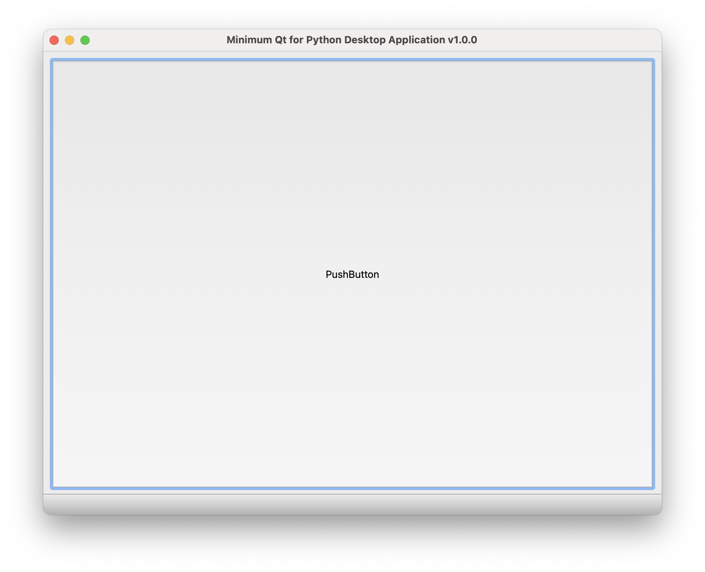

# Minimum Qt for Python Desktop Application Demo



**This is only for demonstrating and reference.**

## Usage

```
pdm run desktop-app
```

## Installation

Install with [pipx](https://pipx.pypa.io/stable/installation/)

```
pipx install git+https://github.com/mrjohannchang/minimum-qt-for-python-desktop-application-demo.git
```

## Development

### Design concepts

1. [Object-oriented programming](https://en.wikipedia.org/wiki/Object-oriented_programming)
2. [Model–view–viewmodel (MVVM)](https://en.wikipedia.org/wiki/Model%E2%80%93view%E2%80%93viewmodel)

### Environment

1. [Python 3.11+](https://www.python.org/)
2. [Qt for Python](https://doc.qt.io/qtforpython)
3. [PDM](https://pdm-project.org/)
4. [Git](https://git-scm.com/)

### Setup

```
pdm install
```

### Step by step reference

1. Create an empty project with [Git](https://git-scm.com/).

    ```
    git init
    ```

2. Initialize the Python project with [PDM](https://pdm-project.org/). I personally prefer the project to be based on [PEP 582 – Python local packages directory](https://peps.python.org/pep-0582/) instead of [PEP 405 – Python Virtual Environments](https://peps.python.org/pep-0405/).

    ```
    pdm init
    ```

3. Add [Qt for Python](https://doc.qt.io/qtforpython) as a dependent library.

    ```
    pdm add PySide6
    ```

4. Create a Main Window [Qt Designer UI file](https://doc.qt.io/qt-6/designer-ui-file-format.html) with [Qt Designer](https://doc.qt.io/qt-6/qtdesigner-manual.html).

    ```
    mkdir src/minimum_qt_for_python_desktop_application_demo_desktop
    touch src/minimum_qt_for_python_desktop_application_demo_desktop/__init__.py
    mkdir src/minimum_qt_for_python_desktop_application_demo_desktop/ui
    touch src/minimum_qt_for_python_desktop_application_demo_desktop/ui/__init__.py
    pdm run pyside6-designer
    ```

5. Create the desktop application entry point. If you chose [PEP 582 – Python local packages directory](https://peps.python.org/pep-0582/) for this project and plan to use PyCharm, at the time of writing, PyCharm does not support PEP 582 directly. Please manually set `__pypackages__/<major.minor>/lib` and `src` as [Sources Root](https://www.jetbrains.com/help/pycharm/configuring-project-structure.html#mark-dir-project-view).

    1. After configuring the script file in `pyproject.toml`, we need to install it:

        ```
        pdm install
        ```

    2. Then we will be able to run it:

        ```
        pdm run desktop-app
        ```

6. Add the logging function to the custom SDK.

7. Use custom `QMainWindow` class to add the window exit hook.

   **Note**: This is undocumented but IMHO the most authenticated way to do it.

8. Demonstrate how to hook the UI building

9. Demonstrate how to get the component from the Qt Designer UI file

10. Demonstrate the usage of [model–view–viewmodel (MVVM)](https://en.wikipedia.org/wiki/Model%E2%80%93view%E2%80%93viewmodel).

## License

[Mozilla Public License Version 2.0](https://www.mozilla.org/en-US/MPL/2.0/)
